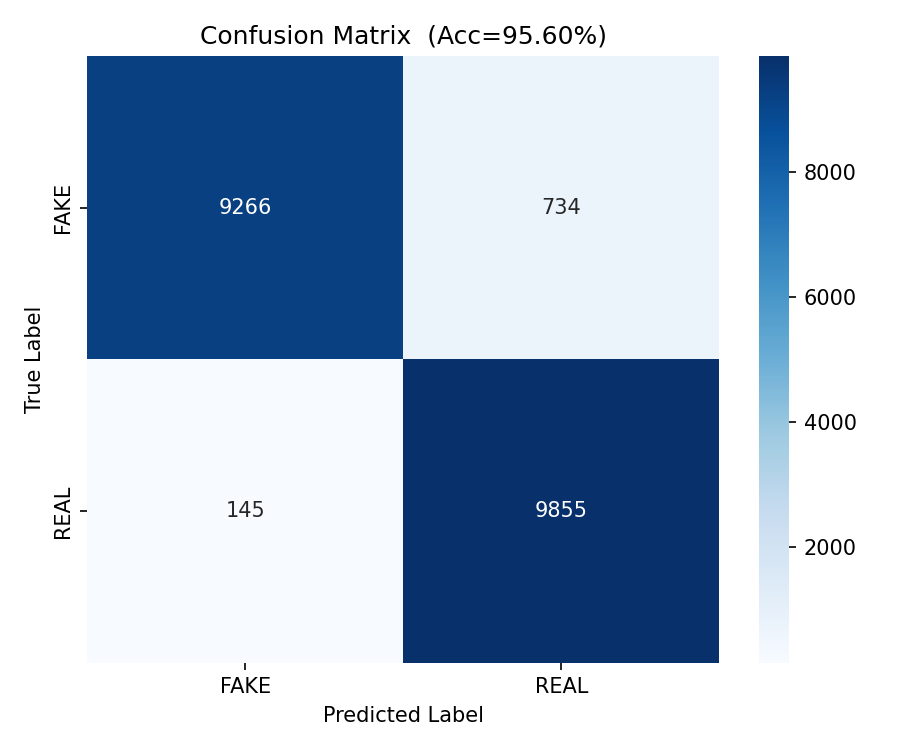
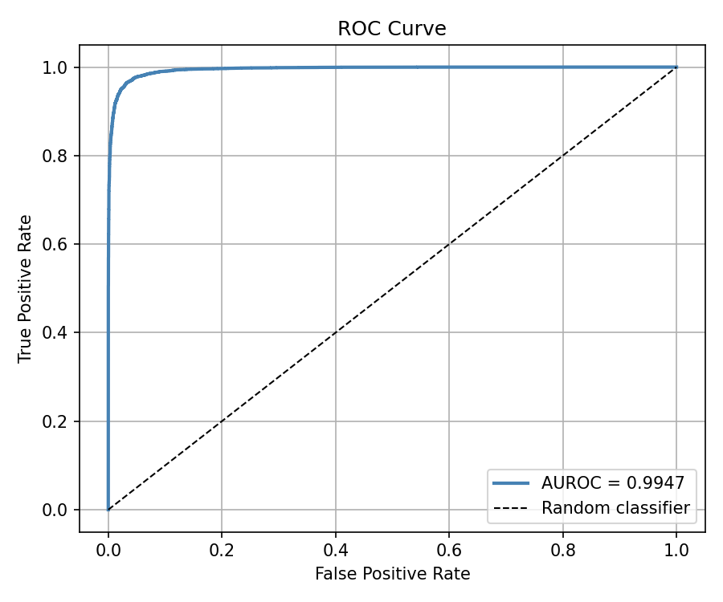
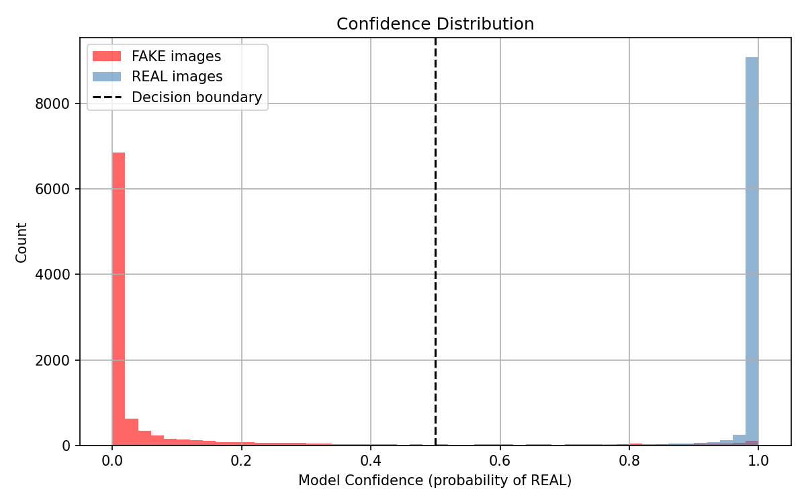

# AI-Image Detector

A deep learning model built **from scratch** (no pretrained weights) to detect whether an image is **real** or **AI-generated**. Trained on 120,000 images using a custom CNN architecture in PyTorch.

---

## Results

| Metric | Score |
|---|---|
| Accuracy | 95.60% |
| AUROC | 0.9947 |
| F1 Score | 0.95 |
| FAKE correctly identified | 9266 / 10000 (92.66%) |
| REAL correctly identified | 9855 / 10000 (98.55%) |

---

## Dataset

**CIFAKE — Real and AI-Generated Synthetic Images**
- 🔗 [kaggle.com/datasets/birdy654/cifake-real-and-ai-generated-synthetic-images](https://www.kaggle.com/datasets/birdy654/cifake-real-and-ai-generated-synthetic-images)
- 100,000 training images (50k REAL, 50k FAKE)
- 20,000 test images (10k REAL, 10k FAKE)
- REAL images sourced from CIFAR-10
- FAKE images generated using Stable Diffusion

---

## Model Architecture

Custom CNN built from scratch with 3 convolutional blocks followed by fully connected layers.

```
Input: 3 × 32 × 32

Block 1: Conv(3→32) → BN → ReLU → Conv(32→32) → BN → ReLU → MaxPool → Dropout(0.25)
Block 2: Conv(32→64) → BN → ReLU → Conv(64→64) → BN → ReLU → MaxPool → Dropout(0.25)
Block 3: Conv(64→128) → BN → ReLU → Conv(128→128) → BN → ReLU → MaxPool → Dropout(0.25)

Flatten: 128 × 4 × 4 = 2048

FC: 2048 → 512 → ReLU → Dropout(0.5)
FC: 512 → 128 → ReLU → Dropout(0.5)
FC: 128 → 2 (FAKE / REAL)

Total Parameters: 1,402,914
```

---

## Training

| Parameter | Value |
|---|---|
| Epochs | 30 |
| Batch Size | 64 |
| Optimizer | Adam (lr=1e-3, weight_decay=1e-4) |
| Scheduler | StepLR (step=10, gamma=0.5) |
| Loss | CrossEntropyLoss |
| Image Size | 32 × 32 |

**Data Augmentation (train only):**
- Random Horizontal Flip
- Random Rotation (±10°)
- Normalization (mean=0.5, std=0.5)

---

## Visualizations

### Confusion Matrix


### ROC Curve


### Confidence Distribution


### Wrong Predictions


---

## Key Finding

The model's errors are not random — it specifically struggles on **photorealistic AI-generated images** that closely resemble real photos. This is the hardest case even for human detection, showing the model has learned genuine distinguishing features rather than simple artifacts.

---

## How to Run

### 1. Clone the repository
```bash
git clone https://github.com/yourusername/ai-image-detector.git
cd ai-image-detector
```

### 2. Install dependencies
```bash
pip install -r requirements.txt
```

### 3. Download the dataset
Download from [Kaggle](https://www.kaggle.com/datasets/birdy654/cifake-real-and-ai-generated-synthetic-images) and organize as:
```
data/
├── train/
│   ├── FAKE/
│   └── REAL/
└── test/
    ├── FAKE/
    └── REAL/
```

### 4. Train the model
run each cell in the jupyter notebook.
```

---

## Tech Stack

- Python 3.10+
- PyTorch 2.0+
- torchvision
- scikit-learn
- matplotlib
- seaborn
- numpy

---

## Project Structure

```
ai-image-detector/
├── project_code                # model architecture + training loop
|                            # evaluation + visualizations
├── requirements.txt         # dependencies
├── model/
│   └── best_model.pth       # saved best model weights
└── results/
    ├── confusion_matrix.png
    ├── roc_curve.png
    ├── confidence_distribution.png
    └── wrong_predictions.png
```

---

## Author

**Your Name**
- GitHub: [@yourusername](https://github.com/yourusername)
- LinkedIn: [yourlinkedin](https://linkedin.com/in/yourlinkedin)
